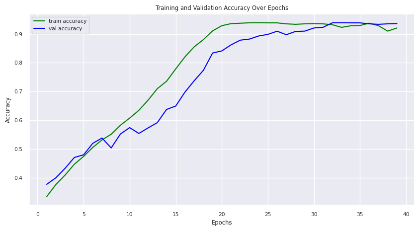
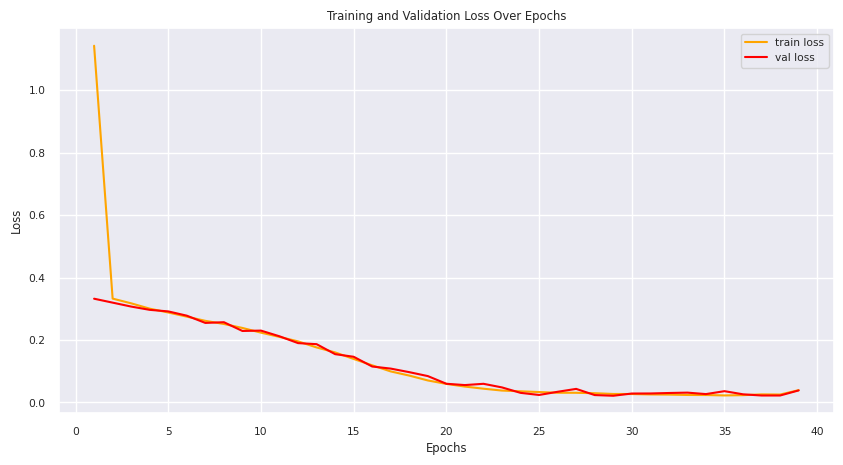
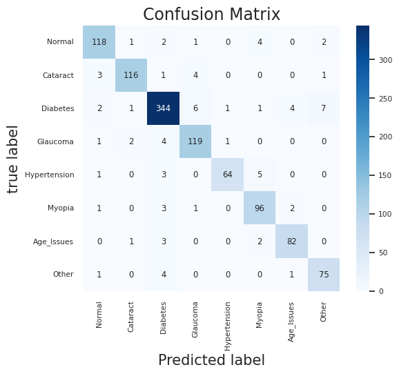

# Eye Disease Detection Using Deep Learning

## Introduction

In recent years, the integration of artificial intelligence (AI) and deep learning techniques has revolutionized the field of medical diagnostics, particularly in ophthalmology. This report explores the transformative impact of deep learning in the identification and diagnosis of eye diseases, emphasizing its potential to enhance precision and efficiency in early detection.

## Problem Definition

The increasing prevalence of eye diseases due to lifestyle changes and extended screen time necessitates accurate detection methods. This project aims to leverage deep learning and fundus images to detect various eye diseases with the highest possible accuracy, enabling early intervention.

## Objectives

The project aims to design a system for accurate detection of various eye diseases through the following steps:
1. Data collection, acquisition, and preprocessing.
2. Identification of suitable deep learning algorithms or networks.
3. Training the selected network on datasets.
4. Comparison of results and identification of the network with the highest accuracy.

## Literature Review

The literature review highlights various research papers and methodologies in the field of eye disease detection using deep learning. Notable studies include automated disease localization, glaucoma detection, and advancements in AI for Dry Eye Disease (DED) detection.

## Analysis for Project Scope

The project scope involves key aspects to ensure comprehensive understanding and successful implementation. Goals include early detection, multi-class classification, high sensitivity and specificity, interpretability, and collaboration with healthcare professionals.

## Work Done

1. **Data Acquisition:**
   - Collected 5450 images from the 'ocular-disease-recognition-odir' database.
   - Categorized images into eight classes, including Normal, Cataract, Diabetes, Glaucoma, Hypertension, Myopia, Age Issues, and Other.

2. **Data Preprocessing:**
   - Implemented binary categorization based on specific diagnostic keywords.
   - Extracted images corresponding to specific conditions.
   - Balanced the dataset to address class imbalances.

## Proposed Method

The proposed methodology involves a shallow Convolutional Neural Network (CNN) enhanced with a Squeeze-and-Excitation (SE) module for improved representational power. The architecture includes a SE module and a CNN model with convolutional layers, max-pooling layers, flattening layers, and fully connected layers.

## Adam Optimizer

The project utilizes the Adam optimizer for efficient training of the deep neural network. Key components include moment estimation, bias correction, and adaptive learning rate adaptation.

## Getting Started

Follow these steps to get started with the project:

1. **Data Collection:**
   - Obtain the 'ocular-disease-recognition-odir' database.
   - Organize images into the appropriate classes.

2. **Data Preprocessing:**
   - Implement binary categorization based on diagnostic keywords.
   - Balance the dataset for training.

3. **Model Training:**
   - Use the proposed CNN architecture with the SE module.
   - Utilize the Adam optimizer for efficient training.

4. **Evaluation:**
   - Compare model results against the testing dataset.
   - Assess accuracy, sensitivity, specificity, and interpretability.

## Model Architecture and Results

### Model Layers

The Convolutional Neural Network (CNN) model architecture consists of several layers, including convolutional layers, global average pooling layers, reshape layers, and dense layers. The detailed layer information is provided in Table 2 of the document. The model aims to detect and classify various eye diseases.

### Hardware and Software Configuration

#### Hardware
The research was conducted on a laptop with the following specifications:
- AMD Ryzen 7 4800H CPU (octa-core)
- GPU: 4 GB GDDR6 NVIDIA GeForce RTX 3050
- RAM: 8 GB

#### Software
The software stack includes:
- VS Code with Jupyter Extension for code execution
- Python for coding
- Libraries: NumPy, Seaborn, Matplotlib, Scikit-learn, TensorFlow, Keras
- Operating System: Windows 10

### Results and Discussion

The deep learning model demonstrated significant performance in eye disease detection. The model achieved an overall accuracy of 92.94% on the test dataset. However, there were variations in memory, precision, and F1-score among different classes, indicating challenges in identifying certain eye conditions.

#### Evaluation Metrics

Precision, recall, and F1-score were used to evaluate the model's performance for each class. The values are presented in Table 3. The model showed promising results, but imbalances in the dataset, especially towards more common classes like "Normal," may impact its performance.

*Figure 2: Training and Validation accuracy of CNN Model*

*Figure 3: CNN Model training and validation loss*

#### confusion matrix

*Figure 5: Confusion matrix*

### Comparison with Previous Work

A comparison with existing methods is presented in Table 5. The model's performance is competitive with other state-of-the-art techniques in eye disease detection.
| Author               | Best Method   | Benchmark Dataset                            | Accuracy   | Outcome             |
|----------------------|---------------|-----------------------------------------------|------------|---------------------|
| Simi Sanya M Seetha  | ResNet50       | Customized dataset comprising fundus images  | 93.9%      | 4 classes           |
| Tahira Nazir, et al  | FRCNN         | Open-source databases (Diaretdb1, MESSIDOR, HRF, DRHAGIS, ORIGA) | 95%      | 3 classes           |
| Md Kamrul et al      | InceptionV3   | Ocular Disease Intelligent Recognition (ODIR) | 97.71%    | 2 classes           |
| Bin Li1 et al        | CNN           | GI4E, BioID                                   | 91.2%      | 2 classes           |
| Stewart Muchuchuti et al | CNN        | EyePACS, ODIR Dataset                         | 97.3%      | 4 classes           |
| Our work (2023)      | CNN + SE module| ODIR                                         | 92.94%     | 8 classes           |

## Conclusion

In conclusion, the application of deep learning in eye disease detection holds great promise for early detection and prevention. The developed model, while showing satisfactory results, leaves room for improvement. Future research can focus on addressing class imbalances, refining the model architecture, and expanding the training dataset for enhanced accuracy and generalization.

## License

This project is licensed under [License Name] - see the [LICENSE.md](LICENSE.md) file for details.

